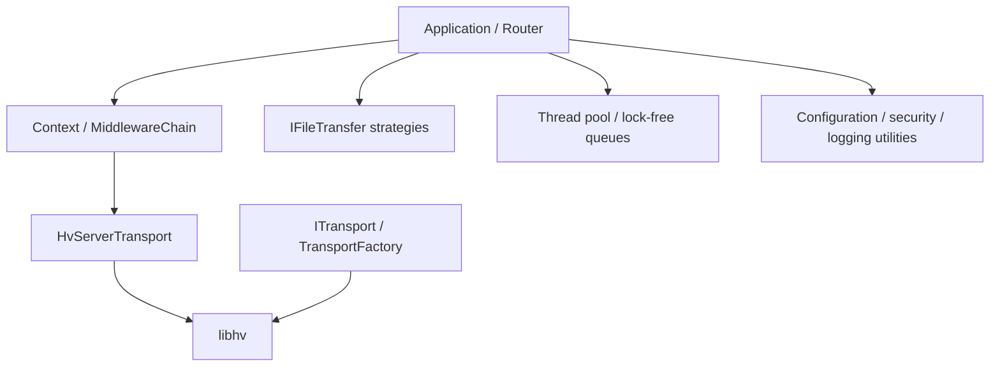

# Intertwine C++ Framework 架构

Intertwine C++ Framework 是面向 Intertwine 系列的 C++11 基础框架。它将服务端路由、客户端传输、文件发送、并发组件和常用工具组织在同一套稳定接口下。

代码命名空间、CMake 包名和静态库名分别为 `intertwine::fw`、`intertwine_cpp_framework` 和 `libintertwine_cpp_framework`。

框架只定义可复用的库接口与构建边界，不包含上层应用的部署目录、服务单元或运行配置约定。

## 分层



| 层级 | 组件 | 职责 |
|------|------|------|
| 核心服务 | `Application`、`Router`、`Context`、`MiddlewareChain` | 服务生命周期、路由、洋葱中间件和请求响应抽象 |
| 服务端传输 | `ServerTransport`、`HvServerTransport` | 将 Router 绑定到 libhv HTTP/HTTPS 服务端 |
| 客户端传输 | `ITransport`、`TransportFactory` | 统一 HTTP、HTTPS、TCP 和 WebSocket 客户端接口 |
| 文件传输 | `IFileTransfer`、`FileTransferFactory` | 兼容、事件驱动和前置代理三类文件发送策略 |
| 并发 | `SupervisedThreadPool`、无锁队列、`FlowController` | 异步任务、队列和背压控制 |
| 工具 | 配置、日志、安全、证书、ID、时间和 JSON 组件 | 提供与业务无关的基础能力 |

## 核心请求流程

1. `Application` 配置服务并挂载 `Router`。
2. `Router` 将路由和共享的 `MiddlewareChain` 绑定到 libhv。
3. libhv 请求对象在适配层中包装为 `Context`。
4. 中间件按洋葱顺序执行，最内层调用业务 handler。
5. 同步 handler 直接完成响应；异步 handler 由 dispatcher 执行。
6. 流式文件传输可通过 `markStreamingHandoff()` 接管 writer 生命周期。

## 依赖边界

- 常规业务 handler 只依赖 `Context`、`Router` 和框架常量。
- libhv 类型集中在桥接、传输和实现文件中。
- `ITransport` 与 `IFileTransfer` 分别抽象客户端网络调用和服务端文件发送。
- 配置、日志和安全工具不依赖业务模型。
- CMake 安装目标导出框架自身及其必要的传递链接依赖。

## 文件传输架构

| 策略 | 适用场景 | 生命周期 |
|------|----------|----------|
| `legacy` | 兼容现有同步 handler；按大小选择响应体或流式发送 | 小文件同步，大文件可能使用 writer |
| `stream` | 大文件或需要稳定内存占用的下载 | IO loop 驱动，策略负责结束响应 |
| `accel` | 由支持内部重定向的前置代理发送文件 | 框架只设置响应头，不读取文件内容 |

`TransferStats` 使用原子计数维护累计次数、字节数、活跃数、错误数和耗时。

## 并发模型

- libhv event loop 负责网络事件。
- `Application::makeAsyncDispatcher()` 将异步路由任务交给 libhv async 执行器。
- `SupervisedThreadPool` 提供独立的受监督任务执行能力。
- `LockfreeQueue` 面向 MPMC，`SPSCQueue` 面向单生产者单消费者。
- `FlowController` 提供队列容量判断和丢弃统计。
- 流式传输将 writer 操作投递到 writer 所属 IO loop，避免跨线程直接操作连接。

## 目录结构

```text
intertwine-cpp-framework/
├── include/intertwine/fw/       # 公开头文件
├── src/              # 实现
├── test/             # 单元测试
├── doc/              # API、架构和模块文档
├── cmake/            # CMake 包配置模板
├── third_party/      # Git 子模块
├── build.sh          # Unix 构建入口
└── build.ps1         # Windows 构建入口
```

## libhv 缓存构建

libhv 安装产物缓存在仓库的 `build_cache/libhv_install/`，中间构建目录为 `build_cache/libhv_build/`。仅执行框架的 `--clean` 不保证重建 libhv。

修改 libhv 子模块后，可在仓库根目录清理对应缓存并重新构建：

```bash
rm -rf build_cache/libhv_install build_cache/libhv_build build
./build.sh --test
```

以上命令全部使用仓库相对路径，不依赖特定工作站目录。

## 兼容性约束

1. 公共代码保持 C++11 兼容，不使用 generic lambda 等 C++14 语法。
2. 公共头文件位于 `include/intertwine/fw/`，CMake 包名为 `intertwine_cpp_framework`。
3. `Context` 不可复制，可移动；异步代码必须正确管理 writer 所有权。
4. 中间件内部数据优先使用 Context KV，不借用外部可见响应头。
5. 子模块提交必须固定，构建不得依赖未记录的工作站状态。

## 构建与测试

构建命令、安装目录和最小集成示例见 [README.md](../README.md)。

`./build.sh --test` 会构建并运行框架测试；测试覆盖核心请求流程、传输策略、并发组件及基础工具。
