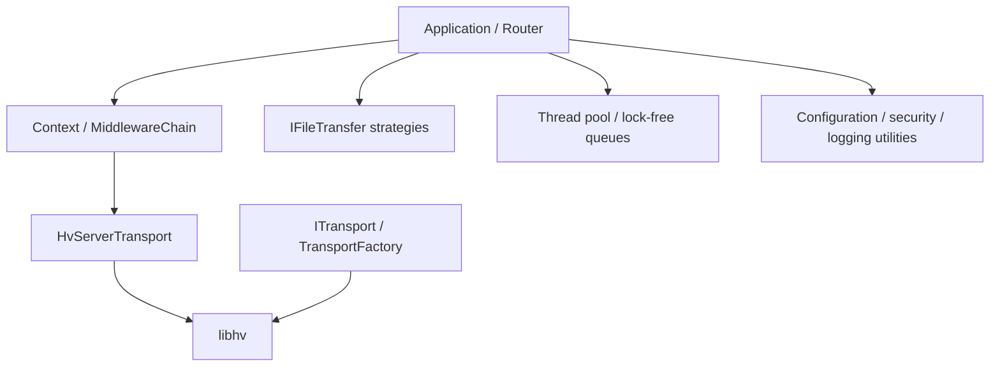

# Intertwine C++ Framework Architecture

Intertwine C++ Framework is a C++11 foundation library for routing, client transport, file delivery, concurrency, and common utilities.

Its namespace, CMake package, and static library are `intertwine::fw`, `intertwine_cpp_framework`, and `libintertwine_cpp_framework`.

The framework defines reusable library boundaries only. It does not prescribe an application deployment directory, service unit, or runtime configuration.

## Layers



| Layer | Components | Responsibility |
|---|---|---|
| Core service | `Application`, `Router`, `Context`, `MiddlewareChain` | Lifecycle, routing, middleware, and request/response abstraction |
| Server transport | `ServerTransport`, `HvServerTransport` | Bind Router to a libhv HTTP/HTTPS server |
| Client transport | `ITransport`, `TransportFactory` | Unified HTTP, HTTPS, TCP, and WebSocket clients |
| File transfer | `IFileTransfer`, `FileTransferFactory` | Compatibility, event-driven, and proxy-assisted delivery |
| Concurrency | `SupervisedThreadPool`, queues, `FlowController` | Tasks, queues, and backpressure |
| Utilities | Configuration, logging, security, certificates, IDs, time, JSON | Business-independent support |

## Request flow

1. `Application` configures a service and mounts a `Router`.
2. `Router` binds routes and shared `MiddlewareChain` instances to libhv.
3. The adapter wraps a libhv request in `Context`.
4. Middleware executes in onion order and reaches the business handler at its center.
5. Synchronous handlers complete the response directly; asynchronous handlers use a dispatcher.
6. A streaming file strategy may call `markStreamingHandoff()` to take over the writer lifecycle.

## Dependency boundaries

- Typical business handlers depend only on `Context`, `Router`, and framework constants.
- libhv-specific types remain in bridge, transport, and implementation code.
- `ITransport` and `IFileTransfer` isolate client networking and server file delivery.
- Configuration, logging, and security utilities do not depend on a business model.
- The CMake install target exports the framework and its required transitive link dependencies.

## File transfer and concurrency

| Strategy | Intended use | Lifecycle |
|---|---|---|
| `legacy` | Existing synchronous handlers | Small files are synchronous; larger files may use a writer |
| `stream` | Large files or stable memory usage | The IO loop drives delivery and the strategy ends the response |
| `accel` | A reverse proxy that supports internal redirects | The framework sets headers and does not read the file |

`TransferStats` uses atomic counters for transfers, bytes, active work, errors, and elapsed time.

libhv event loops own network events. `Application::makeAsyncDispatcher()` dispatches route tasks through libhv async execution. `SupervisedThreadPool` is an independent supervised executor. `LockfreeQueue` is MPMC, `SPSCQueue` is single-producer/single-consumer, and `FlowController` records queue pressure and drops.

Streaming work is posted to the writer's owning IO loop so that connections are not manipulated directly across threads.

## Repository layout

```text
intertwine-cpp-framework/
├── include/intertwine/fw/  # Public headers
├── src/                    # Implementation
├── test/                   # Unit tests
├── doc/                    # Default Chinese documentation
├── doc_en/                 # English documentation
├── cmake/                  # CMake package template
├── third_party/            # Git submodules
├── build.sh                # Unix build entry point
└── build.ps1               # Windows build entry point
```

## libhv cache

libhv artifacts are cached in `build_cache/libhv_install/`; intermediate files are in `build_cache/libhv_build/`. A framework-only `--clean` does not necessarily rebuild libhv.

After changing the libhv submodule, clear its cache from the framework repository root:

```bash
rm -rf build_cache/libhv_install build_cache/libhv_build build
./build.sh --test
```

All paths are repository-relative and do not depend on a workstation-specific location.

## Compatibility and testing

1. Public code remains C++11-compatible and avoids C++14-only features such as generic lambdas.
2. Public headers live in `include/intertwine/fw/`; the CMake package is `intertwine_cpp_framework`.
3. `Context` is movable but not copyable; asynchronous code must manage writer ownership correctly.
4. Middleware should use Context key-value storage rather than externally visible response headers for internal state.
5. Submodule revisions must be pinned; builds must not rely on unrecorded workstation state.

Build commands, installation layout, and the minimal integration example are in the [Chinese README](../README.md). Run `./build.sh --test` to build and execute the framework tests.
